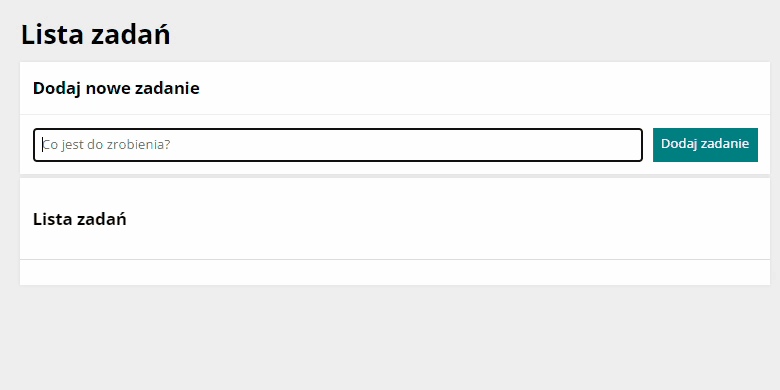

# To do list

## Description 
This is the app that helps you collect all your tasks in one place. Use the form window and the button to add a new task. You can mark your task as done or delete it if you don't need it anymore.

## Demo
You can check the website here: [To do list app](https://kingagrelewicz.github.io/to-do-list/)

## Technology
During creating the website I was using Visual Studio Code and I used a BEM convention, ES6+ Features. The website is built using HTML, CSS, and JavaScript. The website was created to response correctly on desktop, tablets, and mobile devices thanks to using media queries. I used fonts available on Google Fonts, Sharing debugger and flexbox and grid convention.